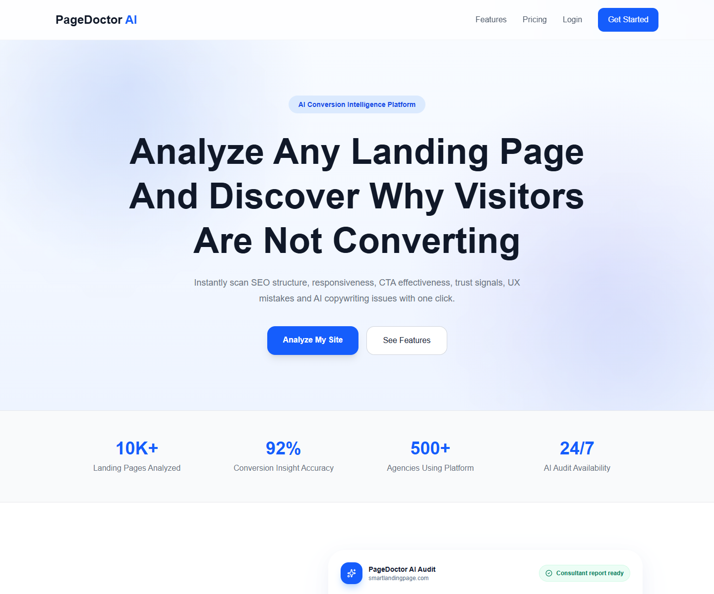

# PageDoctor AI

PageDoctor AI is an AI-powered landing page audit platform that helps founders, marketers, and agencies find conversion friction faster. It scans a landing page or uploaded screenshot, generates CRO-style findings, saves audit history, and creates shareable reports.

**Live Demo:** https://smart-landing-analyzer.vercel.app  
**Repository:** https://github.com/Lionel559/Smart-landingpage-Ai-analyzer  
**Built by:** Lionel

## Screenshots



Recommended additional screenshots for a complete portfolio case study:

| Screen | Suggested file |
| --- | --- |
| Homepage | `docs/screenshots/homepage.png` |
| Dashboard audit flow | `docs/screenshots/dashboard.png` |
| Public report page | `docs/screenshots/public-report.png` |
| PDF export preview | `docs/screenshots/pdf-export.png` |

## Features

- Credentials registration and login
- Google OAuth authentication
- Protected dashboard experience
- URL-based landing page scanning
- Screenshot upload audit flow
- AI-generated CRO findings and quick wins
- Industry-aware audit context
- Audit confidence and accuracy notices
- Weekly free-plan scan limit
- Saved audit history
- Public/private report sharing
- Copyable report links
- PDF report export
- Delete audit reports
- Responsive homepage and dashboard UI

## Tech Stack

- **Frontend:** Next.js 16, React 19, TypeScript, Tailwind CSS, Lucide React
- **Backend:** Next.js Route Handlers, Prisma ORM
- **Database:** Supabase PostgreSQL
- **Authentication:** NextAuth.js, Google OAuth, credentials auth
- **AI:** OpenRouter-compatible chat completions, screenshot-aware audit logic
- **PDF:** jsPDF
- **Scanning:** Puppeteer, Cheerio, custom URL safety validation

## Architecture Overview

```text
app/
  api/
    auth/           NextAuth route
    scan/           Authenticated scan + quota + audit persistence
    audits/         Audit history, privacy updates, delete route
    fix-section/    Authenticated AI rewrite helper
  dashboard/        Protected app dashboard
  report/[id]/      Public/private report page

components/
  auth/             Login and registration UI
  dashboard/        Analyzer, audit results, history, scoring UI
  home/             Landing page sections
  report/           Share, privacy, PDF controls

lib/
  aiAudit.ts        AI audit generation and fallback analysis
  scanner.ts        DOM/page scanner
  visionScan.ts     Visual analysis helper
  validateScanUrl.ts Public URL safety validation
  authOptions.ts    NextAuth configuration
  prisma.ts         Prisma client

prisma/
  schema.prisma     Database schema
  migrations/       Production database migrations
```

The scan route is the core orchestration layer. It authenticates the user, validates the target URL, enforces weekly free-plan limits, runs page/screenshot analysis, requests AI findings, stores the audit, and returns dashboard-ready data.

## Setup

1. Clone the repository.

```bash
git clone https://github.com/Lionel559/Smart-landingpage-Ai-analyzer.git
cd Smart-landingpage-Ai-analyzer
```

2. Install dependencies.

```bash
npm install
```

3. Create an environment file.

```bash
cp .env.example .env
```

If `.env.example` is not present, create `.env` manually using the variables below.

4. Generate Prisma client.

```bash
npx prisma generate
```

5. Apply database migrations.

```bash
npx prisma migrate deploy
```

For local prototyping only, `npx prisma db push` can sync the schema without migrations.

6. Start the development server.

```bash
npm run dev
```

7. Open the app.

```text
http://localhost:3000
```

## Environment Variables

```env
DATABASE_URL=
DIRECT_URL=

NEXTAUTH_SECRET=
NEXTAUTH_URL=http://localhost:3000
NEXT_PUBLIC_APP_URL=http://localhost:3000

GOOGLE_CLIENT_ID=
GOOGLE_CLIENT_SECRET=

OPENROUTER_API_KEY=
```

## Production Build

```bash
npm run build
```

The build script runs `prisma generate` before `next build`.

## Known Limitations

- AI audits are guidance and may not be 100% accurate.
- Some websites block automated scanners or screenshot capture.
- Screenshot-only audits depend on image quality and visible page context.
- Free users are limited to 2 audits per week.
- Billing and paid plan checkout are intentionally not implemented yet.
- Public report screenshots use stored audit data; missing screenshots show a fallback state.

## Future Improvements

- Add Stripe billing and subscription management
- Add team workspaces for agencies
- Add branded white-label PDF reports
- Add richer scan progress telemetry
- Add more automated tests for route handlers and quota logic
- Add final repository screenshots under `docs/screenshots`
- Add a production Open Graph screenshot instead of the app icon

## Author

Built by Lionel.

- GitHub: https://github.com/Lionel559
- LinkedIn: https://www.linkedin.com/in/lionel559

## License

MIT
